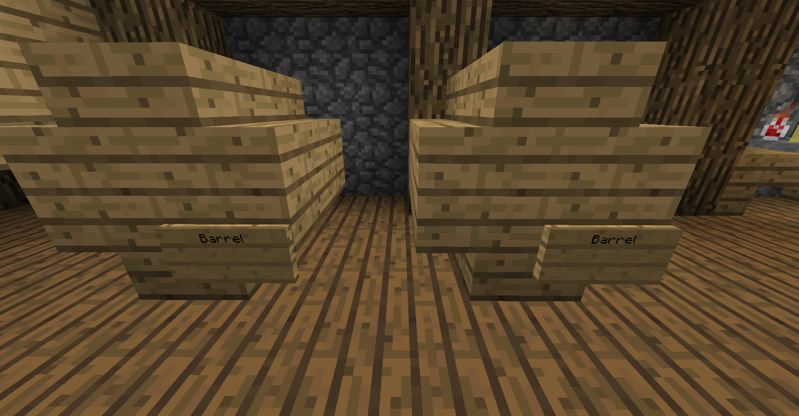

# **How to Brew**
---

## **Fermentation**
To begin creating a brew, gather the ingredients you want (you will need to experiment for the perfect brew). Then place a cauldron filled with water over a source of heat (such as fire). Right click the cauldron with your ingredients, and then wait a few minutes. You can then fill bottles with your ferment.  

You can click a cauldron with a clock to see how long the ingredients have been fermenting.  

## **Distillation**
Whether this process is required or not, and the amount of times required to do it depends on the brew.  

To distill a brew, put the brew with ferment into a brewing stand with glowstone dust in it.  

Be careful, as brews take different times to distill, and some brews even require multiple distillings.  

## **Aging**
Whether this process is required or not, and the amount of time you need to wait depends on the brew.  

After distilling your brew, you sometimes need to age it. To age it, you put your drink in a barrel and wait for any number of Minecraft days. Each brew has it's own optimal (or none at all) age.  

You can use different types of barrels for aging. You can use a Minecraft barrel (2 drink slots), a small barrel, or a big barrel. Images of how to build the small and big barrels are below.  

