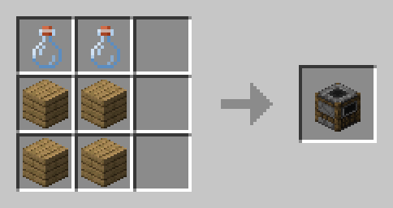

# **Sealing Brews**
---
This process is optional and does not affect the quality of a brew.  

If you wish to sell your brew in a chestshop, it is recommended that you seal it.  

To craft a sealing table, put 2 empty bottles over 4 planks. Then, you can seal any brews you have with this table. Sealing will PERMANENTLY make them unmodifiable.   

