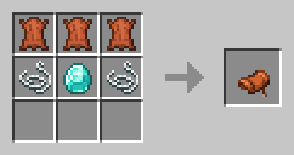
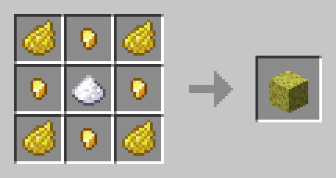
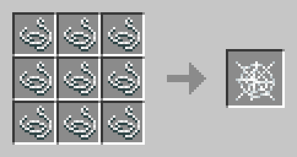
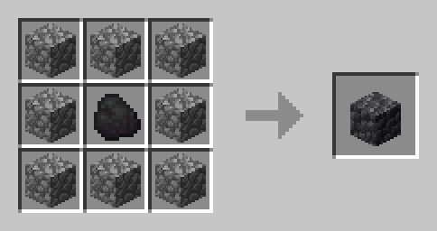
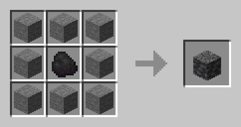
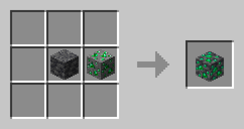
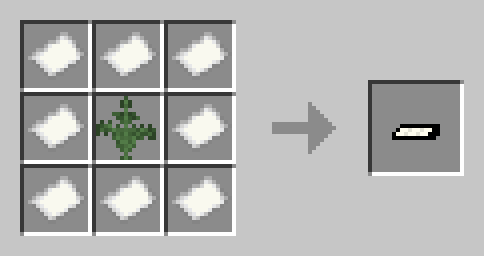
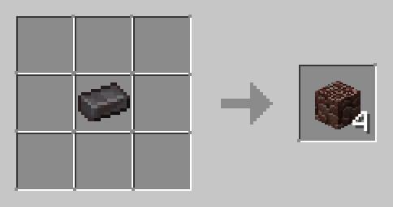

# **Custom Recipes**
---
Here is a non-exhaustive list of custom recipes and loot in GlobalSphere (brewery and steel recipes are not listed here):  

Saddle:  

Sponge:  

Cobweb:  

Cobbled deepslate:  

Deepslate:  

Deepslate ores: (shapeless, may use any ore)  

Unlit joint:  

Netherite ingot uncrafting: (shapeless)  

# **Custom Loot**
---
- Drowned
  - 0-3 Prismarine shards (1-5 with looting)
  - 0-3 Prismarine crystals (1-5 with looting)
- Iron golems (now copper golems in-game)
  - Same loot table as iron golems but with copper ingots
