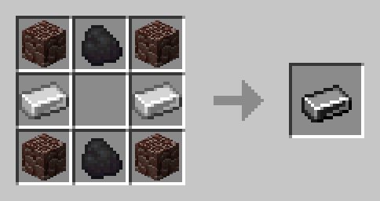
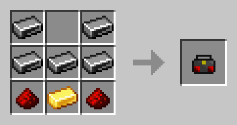
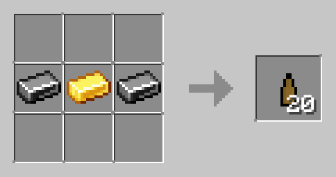
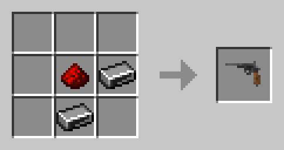
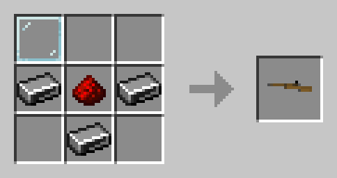

# **Steel**
---
Steel is a complex alloy added by a mod that GlobalSphere uses. It can be used to make stronger gear and new weapons.  

Textures for all items are available for both Java and Bedrock. However, we are unable to texture the gun bullet due to in-game limitations.

# **Steel Ingots**
---
Steel ingots are the base material for all steel crafts.

# **Steel Armor**
---
With steel, you can upgrade your iron armor. When wearing the full steel armor set, you get resistance I. Upgrading your armor will keep all enchantments.  

To upgrade a piece of armor, hold it in your hand. Next, make sure you have 4 steel ingots. Then, do /upgradearmor. Done!  

# **Radios**
---
Radios are a fun item. When right clicking, they can tell you one of 6 messages. The messages are changed every now and then. Sometimes, they can give gameplay tips and hints to future updates.  

# **Firearms**
---
Steel allows you to craft primitive firearms. While they can be powerful in some situations, ammo is expensive, so make sure to not waste it!  

All damage values listed are without armor.  

## **Ammo**
For all guns, there is only one type of ammo. Every gunshot consumes only one ammo.  

## **Pistols**
Pistols can fire every 0.5 seconds. It does 19 damage per hit.  

## **Sniper Rifles**
Snipee rifles can fire every 4 seconds. Up close, it deals 12 damage, but far away, it deals 30 damage.  

